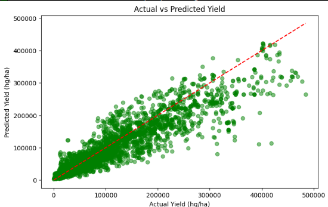

🌾 Crop Yield Forecasting Model

This project predicts crop yield (hg/ha) using agricultural and climatic factors such as rainfall, pesticide use, and temperature. It was developed for the Hackathon Challenge with the goal of building a lightweight, accurate, and easily testable forecasting system.

📂 Dataset

Source: Provided CSV (yield_df.csv)

Records: ~28,000 entries

Features:

Area – Country/Region

Item – Crop type

Year

average_rain_fall_mm_per_year

pesticides_tonnes

avg_temp

Target:

hg/ha_yield – Yield per hectare

Preprocessing:

Label encoding for categorical features (Area, Item)

Standard scaling for numerical inputs

Training/Validation:

80% train, 20% test split

Evaluation metrics: RMSE, R²

✅ Results

RMSE: 31,534

R² Score: 86.29%
✔️ This means the model explains ~86% of the variance in crop yield data.

📊 Visualization

Actual vs Predicted Yield (hg/ha):

The scatter plot shows predicted yields (green dots) aligning closely with the ideal line (red), demonstrating strong model accuracy.

🔎 Sample Prediction

Example test input and prediction:

Input:
- Country: Pakistan
- Crop: Wheat
- Year: 2010
- Rainfall: 800 mm
- Pesticides: 2000 tonnes
- Avg Temp: 22°C

Predicted Yield: 10.14 hg/ha